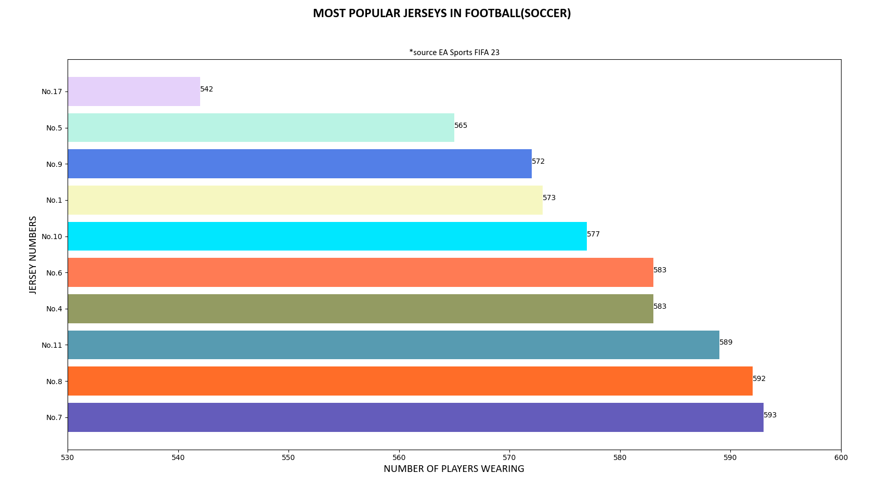
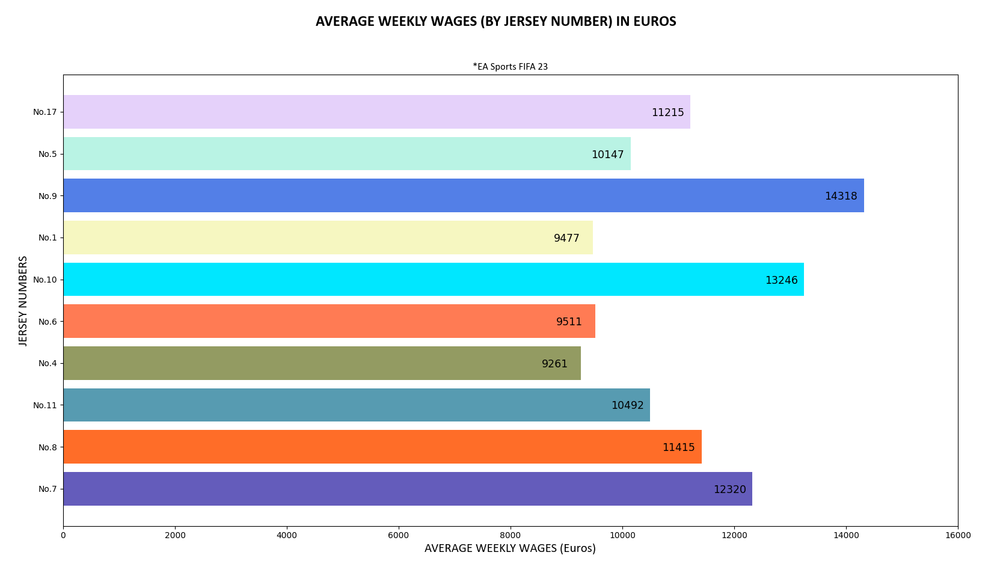
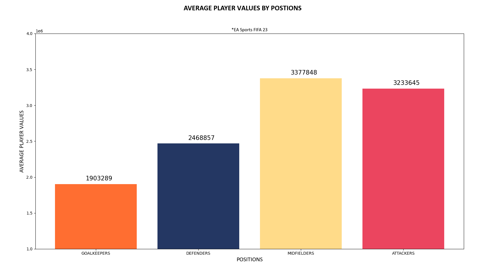
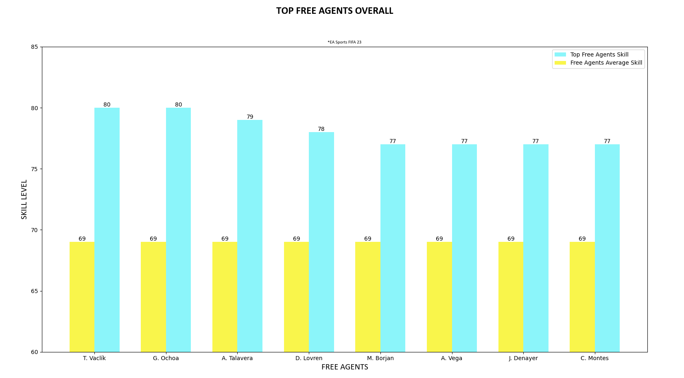

<strong>ABOUT</strong> 
 
Analyzing EA Sports FIFA23 game data. This comprehensive analysis includes over 15 charts of interesting findings.
The analysis is written in VS Code, using Python, Pandas, and Matplotlib. I divided entire project into python packages and modules so it is easier to navigate.
 
 
I searched the database for some interesting findings. Inside, you'll find not only what are the most popular jerseys
among football(soccer) players, but average salaries of players wearing them. The project includes finding best free agents by positions as well as players with the highest growth pootential. 

<strong>HOW TO FIND WHAT YOU WANT?</strong> 
 
Packages are divided into clubs, free agents and players. Each contains python modules relevant to the package title. The assets folder containing images is also split into the sections named after the packages.

<strong>SCREENSHOTS</strong>

